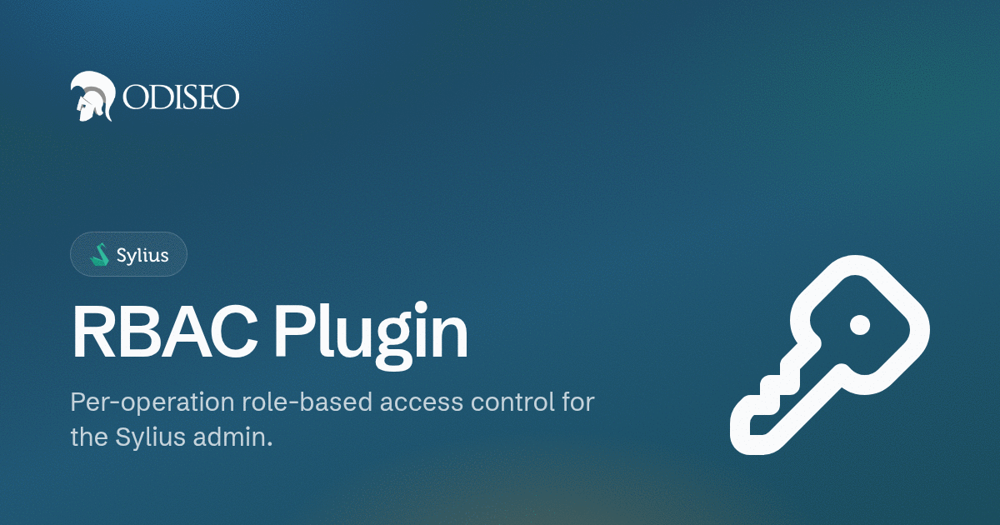

<p align="center">
    <a href="https://odiseo.io/en/products/sylius-plugins?utm_source=github&utm_medium=readme&utm_campaign=sylius-rbac-plugin" target="_blank">
        
    </a>
</p>

<h1 align="center">Sylius RBAC Plugin</h1>

<p align="center">
    <a href="https://packagist.org/packages/odiseoteam/sylius-rbac-plugin"></a>
    <a href="https://packagist.org/packages/odiseoteam/sylius-rbac-plugin"></a>
    <a href="https://github.com/odiseoteam/SyliusRbacPlugin/actions/workflows/build.yaml"></a>
    
    
    <a href="LICENSE"></a>
</p>

---

This plugin adds role-based access control to the Sylius admin: you define your own roles, one permission per operation on one resource, and it enforces them everywhere.

## What you get

- **One permission per operation**: `sylius.product.update` and `sylius.product.delete` are separate permissions. Wildcards keep it manageable: `sylius.product.*`, `*.*.index`, `*.*.*`.
- **Every admin route covered**: Permissions are discovered from Sylius' own resource metadata, so routes added by Sylius or by other plugins are covered automatically.
- **Admin API coverage**: This plugin covers all the APIs operations.
- **Deny by default**: An unprotected route is denied, not allowed. Exceptions are explicit, in config.
- **UI filtered, not just routes**: Menu entries, grid buttons and dashboard widgets check the same permission, so what a role can't use isn't rendered.
- **Workflow transitions have their own permission**: Cancelling an order asks for `sylius.order.cancel`, not `sylius.order.update`.
- **Multiple roles per administrator**: Roles are additive, with a lockout guard on the roles screen.
- **Console tooling**: Grant access from the CLI, list permissions, find orphaned ones, migrate v2 data.
- **18 locales**: Including English, Spanish, French, German, Polish, Portuguese, Simplified Chinese and Arabic.

## Screenshots

<p align="center">
    <a href="doc/managing-roles.md#editing-permissions">
        
    </a>
</p>

<table>
    <tr>
        <td width="50%" align="center">
            <a href="doc/managing-roles.md#the-roles-screen"></a>
            <br /><sub><b>Roles:</b> The ones you define, not a fixed list</sub>
        </td>
        <td width="50%" align="center">
            <a href="doc/managing-roles.md#assigning-roles"></a>
            <br /><sub><b>Assignment:</b> An administrator may hold several roles</sub>
        </td>
    </tr>
    <tr>
        <td width="50%" align="center">
            <a href="doc/enforcement.md#the-main-menu"></a>
            <br /><sub><b>Menu:</b> Trimmed to what the role can reach</sub>
        </td>
        <td width="50%" align="center">
            <a href="doc/enforcement.md#grid-actions"></a>
            <br /><sub><b>Grids:</b> No Create, no Delete, for a role without them</sub>
        </td>
    </tr>
</table>

## What a permission looks like

Every permission is `{package}.{subject}.{operation}`, the same code Sylius' own resource
metadata produces:

```
sylius.product.update                  one operation on one resource
sylius.product.*                       everything on products
sylius.order.ship                      an operation that is not CRUD
*.*.index                              a read-only role, across the whole application
*.*.*                                  a super administrator
```

A role stores the pattern as written, not the list of operations it matches today, so
`sylius.product.*` keeps working when Sylius adds a new operation to products later. See
[The permission model](doc/permissions.md).

## Documentation

|                                                 |                                                              |
| ----------------------------------------------- | ------------------------------------------------------------ |
| [Installation](doc/installation.md)             | Three steps with Flex, plus the two the recipe cannot do     |
| [The permission model](doc/permissions.md)      | Identifiers, patterns, wildcards, how the tree is built      |
| [What gets enforced](doc/enforcement.md)        | The six surfaces, and what happens to a route nobody covered |
| [Managing roles](doc/managing-roles.md)         | Day-to-day use of the admin screens                          |
| [Configuration reference](doc/configuration.md) | Every key under `odiseo_sylius_rbac`                         |
| [Extending](doc/extending.md)                   | Declaring permissions for your own routes and plugins        |
| [Console commands](doc/console.md)              | `grant`, `debug`, `migrate-permissions`                      |
| [Troubleshooting](doc/troubleshooting.md)       | Locked out, unexpected 403, orphaned declarations            |
| [Upgrading to 3.0](UPGRADE-3.0.md)              | What breaks, and how stored roles are migrated               |
| [Contributing](CONTRIBUTING.md)                 | Running the test application and the suites                  |

## Compatibility

| Plugin | Sylius          | PHP             | Symfony   |
| ------ | --------------- | --------------- | --------- |
| `^3.0` | 2.0 · 2.1 · 2.2 | 8.2 · 8.3 · 8.4 | 6.4 · 7.x |
| `^2.0` | 1.12 · 2.0      | 8.0+            | 5.4 · 6.x |

Only the latest minor is supported. Security fixes land on `master`.

## Demo

Want a live walkthrough of this plugin? [Get in touch](https://odiseo.io/en/contact-us?utm_source=github&utm_medium=readme&utm_campaign=sylius-rbac-plugin), or browse all our Sylius plugins at [odiseo.io](https://odiseo.io/en/products/sylius-plugins?utm_source=github&utm_medium=readme&utm_campaign=sylius-rbac-plugin).

## Credits

This plugin is maintained by [Odiseo](https://odiseo.io/en?utm_source=github&utm_medium=readme&utm_campaign=sylius-rbac-plugin). Want us to help you with this plugin or any Sylius project? [Get in touch](https://odiseo.io/en/contact-us?utm_source=github&utm_medium=readme&utm_campaign=sylius-rbac-plugin).

Running a marketplace? Vendor role separation is one of the things a [multi-vendor marketplace for Sylius](https://odiseo.io/en/products/sylius-marketplace-plugin?utm_source=github&utm_medium=readme&utm_campaign=sylius-rbac-plugin) has to get right, and this plugin is how we do it.

## License

[MIT](LICENSE).
