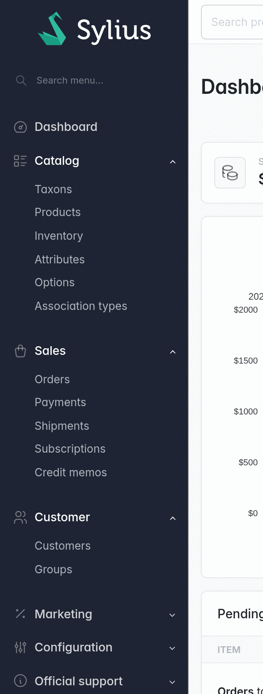
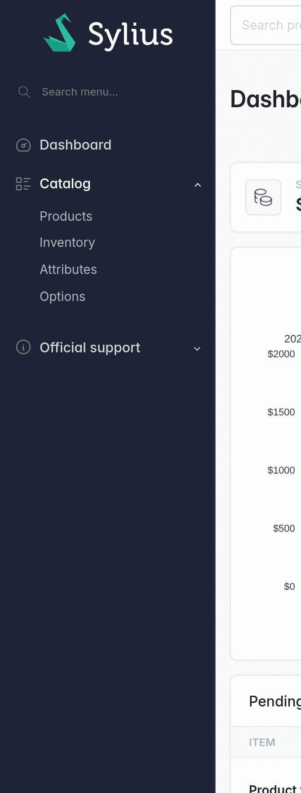
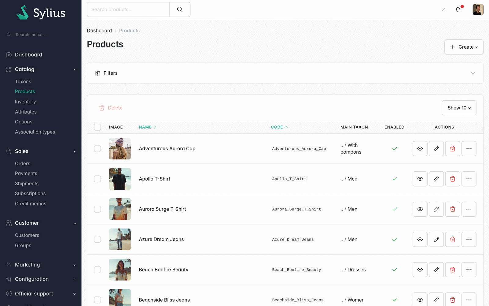
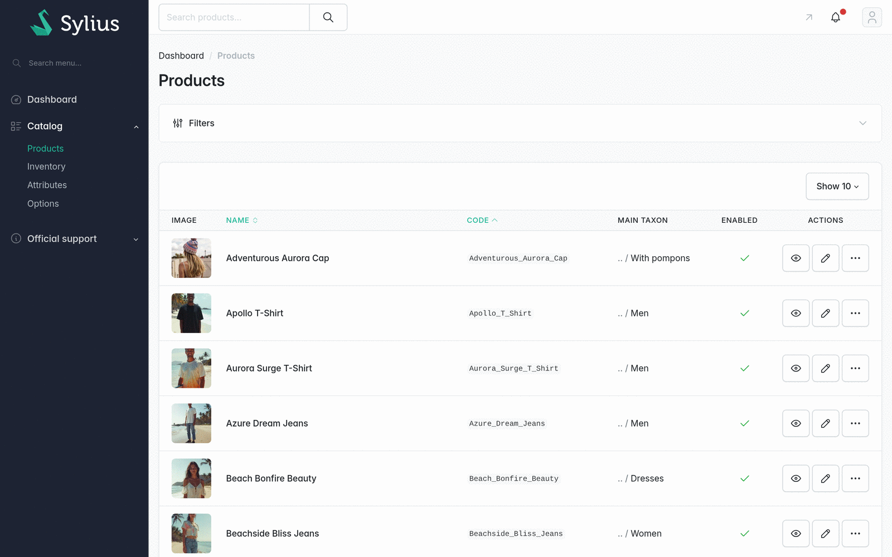

[← The permission model](permissions.md) · [Docs index](README.md) · [Managing roles →](managing-roles.md)

# What gets enforced

Every check ends in the same place: a Symfony voter answering *may this administrator perform
`{package}.{subject}.{operation}`?* The surfaces below only differ in how they arrive at the
question.

That single answer is also available to your own code:

```twig
...
```

```php
$this->denyAccessUnlessGranted('sylius.order.refund', $order);
```

## The six surfaces

| Surface | What happens when the permission is missing |
|---|---|
| [Admin routes](#admin-routes) | 403 |
| [Admin API](#the-admin-api) | 403, as a JSON response |
| [The main menu](#the-main-menu) | The entry is not rendered |
| [Grid actions](#grid-actions) | The button is not rendered |
| [Action buttons and widgets](#action-buttons-and-dashboard-widgets) | The hookable renders nothing |
| [Live components](#live-components) | The live action is denied |

The first two are the boundary; the rest exist so an administrator never sees a control that
would answer 403. **Hiding is never the protection**: every hidden thing is denied on its own.

### Admin routes

Three kinds of route reach the admin, and only one is handled by Sylius itself:

1. **A resource route** carrying `_sylius: permission: true`. The resource controller already
   resolves it to a permission code and checks it, the plugin only fills the authorization socket
   Sylius leaves open, so the check reaches the voter instead of always answering `true`.
2. **A route named in `route_permissions`.** Checked by the plugin's own listener, because nothing
   else looks at those declarations. This covers what Sylius leaves uncovered (impersonation,
   resending a confirmation email, invokable controllers) and anything you declare yourself.
3. **Anything else.** Denied, unless it is listed in `excluded_routes`. See
   [deny by default](#deny-by-default).

Two routes are a case of their own, because each is a single route shared by many different
things: `sylius_admin_entity_autocomplete` and `sylius_admin_live_component`. Their permission is
resolved per request, from the alias or component name the request carries.

#### Workflow transitions get their own operation

Sylius applies a state machine transition through `updateAction`, so cancelling an order would ask
for `sylius.order.update`, the same permission as editing one. The plugin substitutes the
transition instead:

```
sylius.order.cancel        cancelling an order
sylius.shipment.ship       marking a shipment shipped
sylius.payment.complete    completing a payment
```

That is what makes "may cancel orders" grantable without also granting "may edit orders", and the
API derives the same operation from the URI so the two cannot disagree.

### The admin API

Every `/api/v2/admin` operation is checked against the same identifiers as the HTML admin, so an
administrator's JWT can never do more than their screens can.

Resources with no admin screen of their own, images, translations, provinces, promotion rules,
do not get permissions of their own. They fold into their parent: any mutation asks for
`{parent}.update`, any read for `{parent}.show`. Editing a product image is editing the product.

Denials raise `AccessDeniedException`, which API Platform renders as a 403 JSON response, never as
the login redirect an HTML firewall would produce.

### The main menu

Menu entries are removed based on **each item's own route**, looked up in the same map the request
will use, so a visible entry always leads somewhere that opens. A parent left with no children
and no destination of its own is removed too, rather than expanding into nothing.

| Super admin | Catalog manager |
|---|---|
|  |  |

The role editor is the one screen that builds the menu unfiltered: the tree derives its groups from
the admin menu, and deriving them from *your* menu would hide whole sections from whoever is
editing a role.

### Grid actions

Grid buttons are filtered by decorating the grid definition converter, which is what makes this
cover grids the plugin has never heard of, yours included.

Two ways an action names what it does, and both are used: the standard resource types (`create`,
`update`, `delete`, `show`) resolve through the grid's model class exactly as the resource
controller resolves them, and anything carrying a route resolves through the route map. A `links`
action keeps only the destinations that are allowed, and disappears when none of them is.

| Super admin | A role without create or delete |
|---|---|
|  |  |

### Action buttons and dashboard widgets

Buttons and widgets rendered through Sylius' Twig hooks are gated before Sylius' own renderer sees
them. This is the only place their first render can be stopped: a hookable renders inline as part
of the page that embeds it, never through an HTTP route a listener could intercept.

Which hookable requires what is configuration
([`hookable_permissions`](configuration.md#hookable_permissions)), not a copy of the hook, so it
keeps working when Sylius changes the component or template behind it. A denied hookable renders
nothing rather than throwing: a missing widget is a gap in the layout, not a broken page.

A container of gated items (an *Actions* dropdown, a button group) is granted on **any** of the
permissions inside it, so it does not open onto nothing.

### Live components

A live component's first render is a hookable; its follow-up requests are the shared
`sylius_admin_live_component` route. Both are covered, with each component mapped to the permission
its own screen already checks: the dashboard's "shipments to ship" widget asks for
`sylius.shipment.index`, so a role missing that resource simply does not see the widget.

Components that change nothing and expose nothing, such as the dashboard's channel selector, are
listed as deliberately ungated.

## Deny by default

A route no permission covers is **denied**. This is the failure the plugin exists to prevent: the
pre-v3 engine let an unmapped route through, so every route added by a third-party plugin was open.

Deliberate exceptions are configuration, not silence:

```yaml
odiseo_sylius_rbac:
    excluded_routes:
        - sylius_admin_login
        - sylius_admin_dashboard
```

Listing a route is what makes "decided to leave it open" distinguishable from "forgot about it",
and the plugin's own test suite verifies the list, failing if something declared public is not
actually anonymous, or if an entry names a route that no longer exists.

While migrating an application with many uncovered routes you can invert this temporarily:

```yaml
odiseo_sylius_rbac:
    deny_unprotected_admin_routes: false
```

Run [`odiseo:rbac:debug --strict`](console.md#the-coverage-check) to see what is still uncovered
before turning it back on.

## Anti-lockout

Saving a role that would leave *you* unable to reach the roles screen is refused, with a flash
message naming what you were about to lose.

The question asked is "would this leave me without it?", never "was the box unticked": roles are
additive, so another of your roles may still grant it, and a `*.*.*` in the role you are editing
covers it without naming it.

Only your own access, and only on update. Deleting a role, or removing it from your own account,
are deliberately left open, and [`odiseo:rbac:grant`](console.md#granting-access) is the way back
from any of them.

## Restricting *which records*, not which screens

The voter asks two questions: does the administrator hold a matching pattern, **and** does the
scope resolver accept the subject?

```php
interface ScopeResolverInterface
{
    public function isInScope(
        AdministrationRoleAwareInterface $administrator,
        PermissionIdentifier $permission,
        mixed $subject,
    ): bool;
}
```

The shipped implementation allows everything. Replacing or decorating the service is how you make a
permission reach only part of the data, the orders of one channel, say, without touching any of
the six surfaces above. See [Extending](extending.md#restricting-a-permission-to-part-of-the-data).

---

[← The permission model](permissions.md) · [Docs index](README.md) · [Managing roles →](managing-roles.md)
