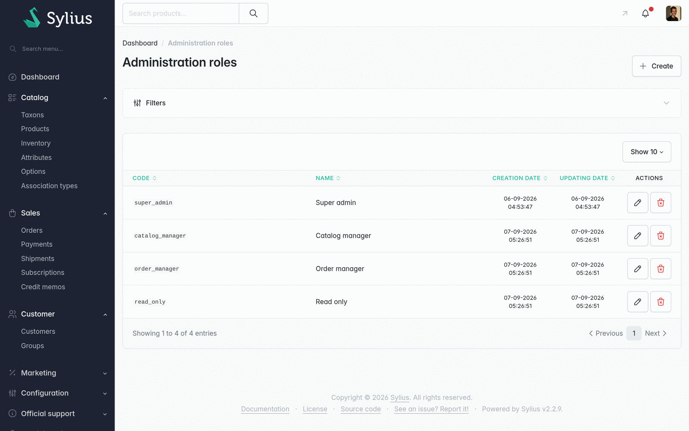
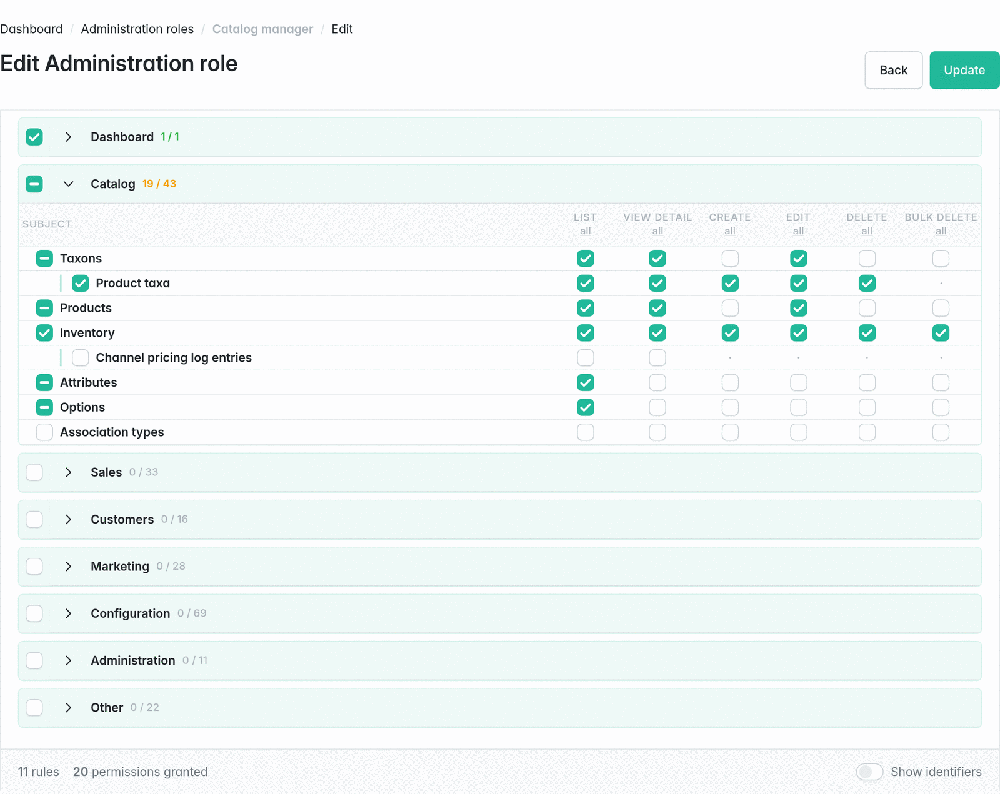
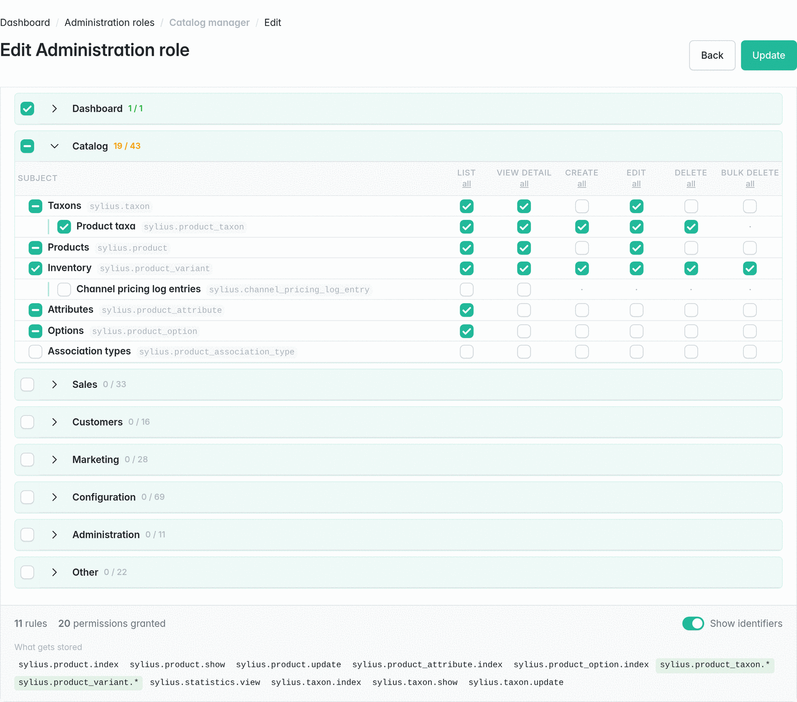
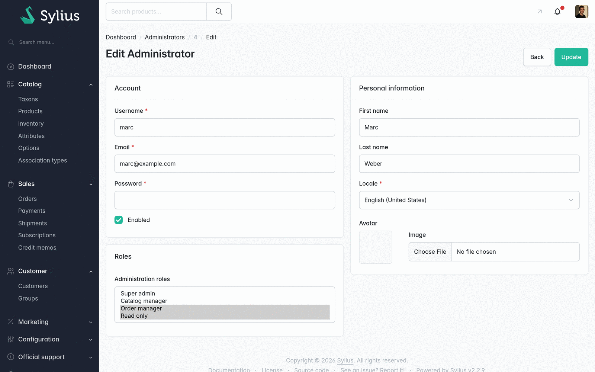
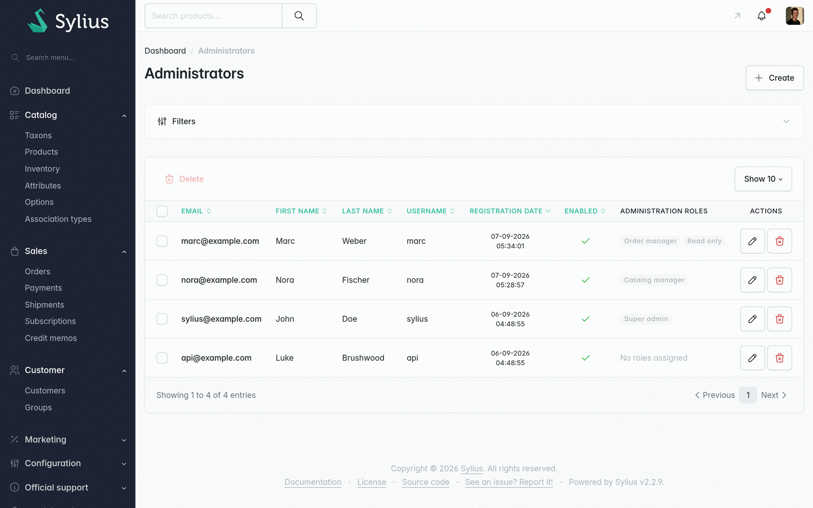

[← What gets enforced](enforcement.md) · [Docs index](README.md) · [Configuration reference →](configuration.md)

# Managing roles

Everything here lives under **Administration → Roles** in the admin panel. The console equivalents
are in [Console commands](console.md).

## The roles screen

A role is a **code**, a **translated name** and its permissions. The code is what console commands
and fixtures refer to; the name is what administrators see, and is translatable like any other
Sylius resource.

Nothing here is built in. `super_admin`, `catalog`, `sales` and `read_only` exist only because the
[fixtures](extending.md#fixtures) created them — rename them, delete them, or start from an empty
list.

> [!WARNING]
> Deleting a role revokes it from every administrator holding it, immediately. If it was the only
> role of the person deleting it, they are locked out on the next request — recover with
> [`odiseo:rbac:grant`](console.md#granting-access).

## Editing permissions

Each group is a section of the admin menu; each row is a subject; each column is an operation.

| Control | What it does |
|---|---|
| Row checkbox | Everything on that subject — stored as `sylius.product.*` |
| Group checkbox | Everything in that section |
| Column **all** | That operation on every subject in the section |
| **Grant: Everything / Read only / Nothing** | Across the whole application: `*.*.*`, the read operations, or clear |
| Filter box | Narrows the tree to matching subjects while you look for one |

Checkboxes are tri-state: a subject or group box is filled when everything below it is granted,
and shows a dash when only part of it is.

Nesting means *reached from inside another screen* — coupons under promotions, product taxa under
taxons — so the row above tells you where in the admin that permission is actually used.

### Seeing what will be stored

Turn on **Show identifiers** in the footer:

Every row gains its identifier, and *What gets stored* lists the exact patterns the role will save.
The two counters next to it read: how many **rules** are stored, and how many **permissions** those
rules grant today.

The distinction matters. `sylius.product.*` is one rule granting six permissions now — and seven
after a Sylius release that adds an operation to products. That is the point of storing patterns
rather than expanding them, and this panel is where you can see which of your choices became a
wildcard and which became a list.

### Read only

*Grant → Read only* stores `*.*.index`, `*.*.show` and `*.*.view`: everything that shows something
without changing it, including resources added later by a plugin you have not installed yet.

## Assigning roles

The **Roles** field on the administrator's own screen. An administrator may hold **several roles**,
and permissions add up — there is no ordering and no precedence, because there is nothing to
resolve: roles only grant.

An administrator with **no** role is denied everything, including this screen. That is the intended
state for a brand new account, not a broken one.

## The guard against locking yourself out

Saving a role that would leave *you* unable to reach the roles screen is refused, with a message
naming what you were about to lose.

It checks your effective access, not the checkbox: another of your roles may still grant it, and a
`*.*.*` in the role you are editing covers it without naming it. Deleting the role, or taking it
off your own account, are not guarded — see
[Troubleshooting](troubleshooting.md#i-locked-everyone-out).

## A role that stops working

Two things change a role's meaning without anyone editing it:

- **A plugin is removed.** Patterns naming its permissions still exist but match nothing.
- **A route is renamed** by a Sylius upgrade. The old declaration is orphaned.

Neither breaks anything, and neither is silent:
[`odiseo:rbac:debug --strict`](console.md#finding-orphans) reports both.

---

[← What gets enforced](enforcement.md) · [Docs index](README.md) · [Configuration reference →](configuration.md)
